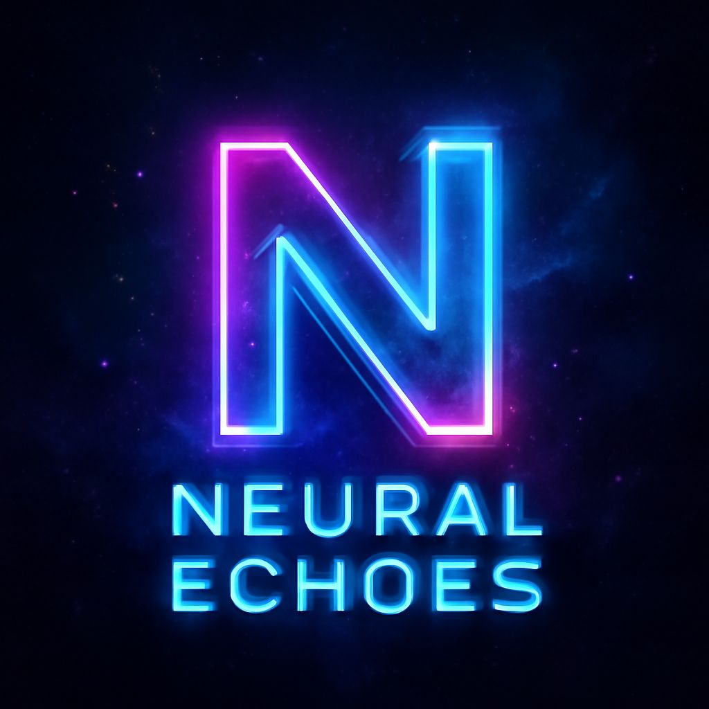
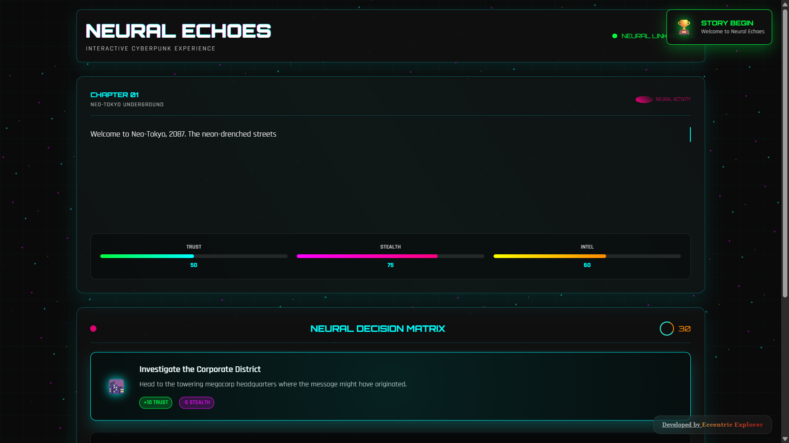

<div align="center"></div>

# <div align="center">NEURAL ECHOES</div>

**Neural Echoes** is a web-based, interactive storytelling application designed to deliver a cyberpunk narrative experience. It features a dynamic story progression, player choices that influence character stats, immersive UI with futuristic animations, and an urgent timed decision-making system. The application is built to be a responsive and engaging experience for users.

---

## 🚀 Live Demo

Experience Neural-Echoes live here: 
👉 [](https://eccentriccoder01.github.io/Neural-Echoes)

 <div align="center">
 <p>

[](https://github.com/ellerbrock/open-source-badges/)


 </p>
 </div>

## 📸 Screenshots

<div align="center"></div>

---

### 💡 Core Features

* **Dynamic Story Progression**: The narrative unfolds based on the player's choices. Each decision leads to a new chapter, allowing for multiple branching storylines and unique playthroughs.
* **Player Character Stats**: The game tracks three core stats—Trust, Stealth, and Intel—which are influenced by player choices. The user interface features animated status bars to visually represent these changes in real-time.
* **Timed Decisions**: Choices are presented with a 30-second timer, creating a sense of urgency and pressure. If the timer runs out, the game automatically selects the first available choice.
* **Choice Consequences**: Each choice has specific consequences, visibly labeled in the UI, that affect the player's stats, providing clear feedback on how decisions impact the character's abilities.
* **Achievement System**: The game includes an achievement system that rewards players for reaching certain milestones, such as making their first choice or achieving high stat values. Notifications pop up to announce these achievements.
* **Navigation & State Management**: The game features a "Go Back" function to explore different narrative paths, manual "Save" and "Load" functionality, and a "Restart" option. An optional auto-save feature is also available in the settings.

### 🎨 Stand-Out Features (User Interface & Experience)

* **Immersive Cyberpunk Aesthetic**: The application's design uses a futuristic, neon-drenched UI with glitch effects, a dark theme, and a custom font stack to create an authentic cyberpunk atmosphere.
* **Typewriter Effect**: Story text is revealed with a typewriter animation, simulating the feel of a terminal or neural interface loading data. The speed of this effect is customizable in the settings.
* **Dynamic Background Effects**: The background of the application is a live, animated scene with several layered effects, including a "matrix rain," a pulsing neon grid, and floating particles. These effects can be toggled on or off in the settings.
* **Responsive Design**: The UI is fully responsive and adapts seamlessly to various screen sizes, ensuring optimal viewing and interaction on desktops, tablets, and mobile devices.
* **Sharing Results**: At the end of the story, players can share their final stats and achievements on social media.
* **Keyboard Shortcuts**: Players can use number keys (1, 2, 3) to select choices and keyboard shortcuts (Ctrl+S for Save, Ctrl+R for Restart) for streamlined navigation.

---

## 🛠️ Technology Stack

Neural-Echoes is built using a standard web development stack, focusing on client-side technologies for a rich interactive experience.


---

## ⚙️ Setup Instructions

To run Neural-Echoes:

### 1. Clone the Repository

```bash
git clone [https://github.com/eccentriccoder01/Neural-Echoes.git](https://github.com/eccentriccoder01/Neural-Echoes.git)
cd Neural-Echoes
````

### 2\. Install Dependencies

Each folder (`js`, `styles`, `favicon`, etc.) is client-side. You can serve the project using any local server (e.g. `Live Server` in VSCode or Python's HTTP server):

```bash
npx live-server .
```
-----

## 🚧 Roadmap & Future Enhancements

  * [ ] Integrate more diverse historical data and future mission plans.
  * [ ] Add audio elements for an even more immersive experience.
  * [ ] Introduce user profiles to save simulator configurations or favorite timeline events.
  * [ ] Enhance data visualizations with more interactive elements and filtering options.
  * [ ] Develop more complex mission simulation scenarios.
  * [ ] Implement a search functionality for timeline events.

---

## Issue Creation ✴

Report bugs and issues or propose improvements through our GitHub repository's "Issues" tab.

## Contribution Guidelines 📑

- Firstly Star(⭐) the Repository
- Fork the Repository and create a new branch for any updates/changes/issue you are working on.
- Start Coding and do changes.
- Commit your changes
- Create a Pull Request which will be reviewed and suggestions would be added to improve it.
- Add Screenshots and updated website links to help us understand what changes is all about.

- Check the [CONTRIBUTING.md](CONTRIBUTING.md) for detailed steps...

## Contributing is fun🧡

We welcome all contributions and suggestions!
Whether it's a new feature, design improvement, or a bug fix - your voice matters 💜

Your insights are invaluable to us. Reach out to us team for any inquiries, feedback, or concerns.

## 📄 License

This project is open-source and available under the MIT License.

## 📞 Contact

Developed by [Eccentric Explorer](https://eccentriccoder01.github.io/Me)

Feel free to reach out with any questions or feedback\!